# paletten

Color-palette tokens generator.

`[beta]`

`paletten` automatically generates tokens from just a argument. 
```js
const colorTokens = paletten('hsl(200 100% 50%)')
```


## Install

```
$ npm i paletten
```

## Usage


```jsx
import paletten from 'paletten'

const primary = paletten('#FF0000') // single argument

return (
  <div style={{ color: primary[700] }}>
    Dark Red Text
  </div>
)
```

```jsx
// paletten will automatically generate other values.

const violet = paletten({
    200: 'hsl(260 83% 76%)',
    700: 'hsl(260 79% 38%)',
})

return (
  <div style={{ color: violet[500] }}>
    Vivid Violet Text
  </div>
)
```

```jsx
// You can set values range from 0 to 1000

const gray = paletten({
    0: 'hsl(0,0%,100%)',
    1000: 'hsl(0,0%,13%)',
})

return (
  <div style={{ color: gray[400] }}>
    Gray Text
  </div>
)
```

### Options
```jsx
const primary = paletten('#FF0000', { prefix: '_' })

return (
  <div style={{ color: primary._500 }}>
    Gray Text
  </div>
)

```

```jsx
const primary = paletten('#FF0000', { format: 'hsl' })

console.log(primary[500])
// result: 'hsl(0, 100%, 50%)'
```

```jsx
const primary = paletten('#FF0000', { variant: 'fine' })
console.log(Object.keys(primary))
// result: [50, 100, 150, 200, 250, 300, 350, 400, 450, 500, 550, 600, 650, 700, 750, 800, 850, 900]
```

```jsx
const primary = paletten('#FF0000', { extend: [10, 75, 150] })
console.log(Object.keys(primary))
// result: [10, 50, 75, 100, 150, 200, 300, 400, 500, 600, 700, 800, 900, 950]
```

```jsx
const primary = paletten('#FF0000', { reversed: true })
primary[100] // <-- will be `primary[900]` value of default.
```

## Adjusted Coloring Templates

---
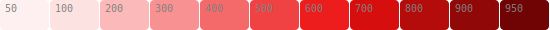
```js
paletten({ 0: "hsl(0 90% 100%)", 100: "hsl(0 90% 94%)", 500: "hsl(0 85% 60%)", 900: "hsl(0 90% 30%)", 1000: "hsl(0 100% 15%)" })
```
---
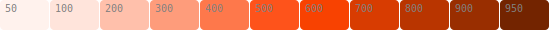
```js
paletten({ 0: "hsl(15 99% 100%)", 100: "hsl(15 99% 93%)", 500: "hsl(15 99% 55%)", 900: "hsl(18 100% 30%)", 1000: "hsl(20 100% 15%)" })
```
---
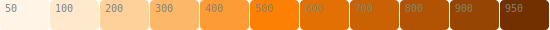
```js
paletten({ 0: "hsl(35 98% 100%)", 500: "hsl(30 98% 50%)", 900: "hsl(27 98% 30%)", 1000: "hsl(23 98% 15%)" })
```
---
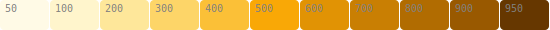
```js
paletten({ 0: "hsl(50 100% 100%)", 500: "hsl(40 95% 50%)", 900: "hsl(35 100% 30%)", 1000: "hsl(30 100% 10%)" })
```
---
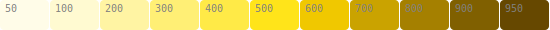
```js
paletten({ 0: "hsl(53 100% 100%)", 500: "hsl(53 100% 55%)", 600: "hsl(50 100% 47%)", 900: "hsl(45 100% 25%)", 1000: "hsl(40 100% 15%)" })
```
---
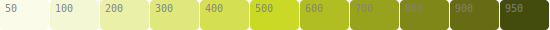
```js
paletten({ 0: "hsl(65 70% 100%)", 500: "hsl(65 70% 50%)", 900: "hsl(65 70% 25%)", 1000: "hsl(70 70% 10%)" })
```
---
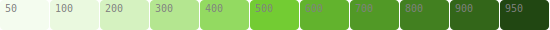
```js
paletten({ 0: "hsl(95 70% 100%)", 200: "hsl(95 65% 85%)", 500: "hsl(95 60% 50%)", 900: "hsl(100 60% 25%)", 1000: "hsl(105 60% 10%)" })
```
---
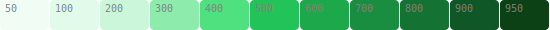
```js
paletten({ 0: "hsl(140 60% 100%)", 100: "hsl(140 70% 93%)", 200: "hsl(140 70% 88%)", 500: "hsl(140 70% 45%)", 900: "hsl(140 70% 20%)", 1000: "hsl(120 70% 10%)" })
```
---
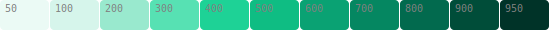
```js
paletten({ 0: "hsl(160 55% 100%)", 100: "hsl(160 60% 90%)", 400: "hsl(160 75% 47%)", 500: "hsl(160 85% 40%)", 900: "hsl(165 100% 15%)", 1000: "hsl(170 100% 5%)" })
```
---
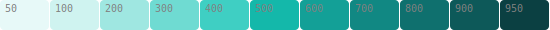
```js
paletten({ 0: "hsl(175 60% 100%)", 400: "hsl(175 60% 53%)", 500: "hsl(175 80% 40%)", 900: "hsl(180 75% 20%)", 1000: "hsl(185 70% 10%)" })
```
---
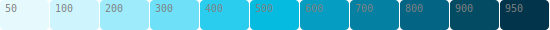
```js
paletten({ 0: "hsl(190 95% 100%)", 300: "hsl(190 90% 70%)", 400: "hsl(190 85% 55%)", 500: "hsl(190 95% 45%)", 900: "hsl(195 95% 20%)", 1000: "hsl(200 95% 10%)" })
```
---

```js
paletten({ 0: "hsl(200 100% 100%)", 100: "hsl(200 100% 93%)", 500: "hsl(200 95% 48%)", 900: "hsl(200 95% 25%)", 1000: "hsl(205 95% 10%)" })
```
---

```js
paletten({ 0: "hsl(215 100% 100%)", 100: "hsl(215 100% 93%)", 500: "hsl(215 90% 60%)", 900: "hsl(215 95% 25%)", 1000: "hsl(220 100% 10%)" })
```
---
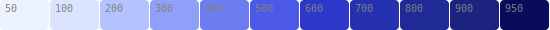
```js
paletten({ 0: "hsl(220 100% 100%)", 100: "hsl(225 100% 93%)", 500: "hsl(235 75% 60%)", 600: "hsl(235 65% 48%)", 900: "hsl(235 65% 30%)", 1000: "hsl(240 100% 10%)" })
```
---
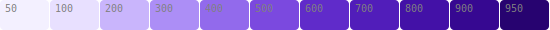
```js
paletten({ 0: "hsl(250 100% 100%)", 100: "hsl(255 100% 94%)", 500: "hsl(260 70% 58%)", 600: "hsl(260 65% 48%)", 900: "hsl(260 90% 30%)", 1000: "hsl(260 100% 15%)" })
```
---
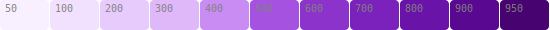
```js
paletten({ 0: "hsl(275 100% 100%)", 100: "hsl(275 100% 94%)", 300: "hsl(275 85% 85%)", 400: "hsl(275 80% 75%)", 500: "hsl(275 70% 60%)", 600: "hsl(275 60% 50%)", 900: "hsl(275 90% 30%)", 1000: "hsl(280 100% 15%)" })
```
---

```js
paletten({ 0: "hsl(285 100% 100%)", 200: "hsl(285 95% 90%)", 500: "hsl(290 80% 60%)", 600: "hsl(290 60% 50%)", 900: "hsl(295 90% 30%)", 1000: "hsl(295 100% 15%)" })
```
---
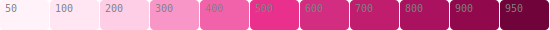
```js
paletten({ 0: "hsl(330 100% 100%)", 200: "hsl(330 95% 90%)", 500: "hsl(330 80% 55%)", 600: "hsl(330 65% 50%)", 900: "hsl(330 90% 30%)", 1000: "hsl(330 100% 15%)" })
```
---
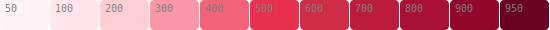
```js
paletten({ 0: "hsl(350 100% 100%)", 200: "hsl(350 95% 90%)", 500: "hsl(350 80% 55%)", 600: "hsl(350 65% 49%)", 900: "hsl(345 90% 30%)", 1000: "hsl(340 100% 12%)" })
```
---
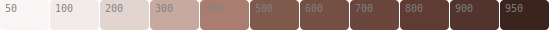
```js
paletten({ 0: "hsl(15 25% 100%)", 100: "hsl(15 25% 93%)", 200: "hsl(15 25% 85%)", 500: "hsl(15 25% 40%)", 900: "hsl(10 30% 25%)", 1000: "hsl(10 35% 10%)" })
```
---
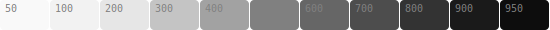
```js
paletten({ 0: "hsl(0 0% 100%)", 100: "hsl(0 0% 95%)", 200: "hsl(0 0% 90%)", 500: "hsl(0 0% 50%)", 1000: "hsl(0 0% 0%)" })
```
---
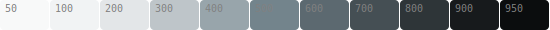
```js
paletten({ 0: "hsl(200 10% 100%)", 100: "hsl(200 10% 95%)", 200: "hsl(200 10% 90%)", 500: "hsl(200 10% 50%)", 1000: "hsl(200 10% 0%)" })
```

## Type Guard
```jsx
import paletten, { PalettenData } from 'paletten'

const primary: PalettenData = paletten('#FF0000')

primary[500] // ○ safe
primary[240] // x error

```

`variant` guard
```jsx
import paletten, { PalettenData } from 'paletten'

type Palette = PalettenData<'coarse'>

const primary: Palette = paletten('#FF0000', {
  variant: 'coarse'
})

primary[100] // ○ safe
primary[50] // x error
```

`extend` guard
```jsx
import paletten, { PalettenData } from 'paletten'

type Palette = PalettenData<unknown, [10, 25, 75]>

const primary: Palette = paletten('#FF0000', {
  extend: [10, 25, 75],
})

primary[25] // ○ safe
```

`prefix` guard
```jsx
import paletten, { PalettenData } from 'paletten'

type Palette = PalettenData<unknown, unknown, '_'>

const primary: Palette = paletten('#FF0000', {
  prefix: '_'
})

primary._500 // ○ safe
primary[500] // x error
```

Full guard
```jsx
import paletten, { PalettenData } from 'paletten'

type Palette = PalettenData<'coarse', [333], '_'>

const primary: Palette = paletten('#FF0000', {
  variant: 'coarse',
  extend: [333],
  prefix: '_'
})

primary._500 // ○ safe
primary._333 // ○ safe
primary[333] // x error
primary._950 // x error
```


## Standardize Multiple Palettes with `Paletten` Class

```jsx
import { Paletten } from 'paletten'

const { paletten } = new Paletten({
    variant: 'fine',
    format: 'rgb',
    extend: [25]
})

const primary = paletten('hsl(0 100% 60%)')
const secondary = paletten('hsl(200 80% 60%)')

return (
    <>
      <div style={{ background: primary[25] }}>
        Primary Background
      </div>
      <div style={{ background: secondary[25] }}>
        Secondary Background
      </div>
    </>
)
```

## API

```ts
function paletten(

  value: 
       | string                         // color code
       | { [key in number]: string },   // Set amounted keys range from 0 to 1000
  options?: {
    format?: 'hex' | 'hsl' | 'rgb',               // default: 'hex'
    variant?: 'fine' | 'standard' | 'coarse',    // default: 'standard'
    extend?: number[],                            // e.g. [50,150,250]
    prefix?: string,                              // e.g. '_'
  }
)
```

#### Class API
```ts
class Paletten(config: {
    format?: 'hex' | 'hsl' | 'rgb',               // default is 'hex'
    variant?: 'fine' | 'standard' | 'coarse',    // default: 'standard'
    extend?: number[],                            // e.g. [50,150,250]
    prefix?: string,                              // e.g. '_'
})
```

## License

[MIT License](https://andreasonny.mit-license.org/2019) © otsubocloud